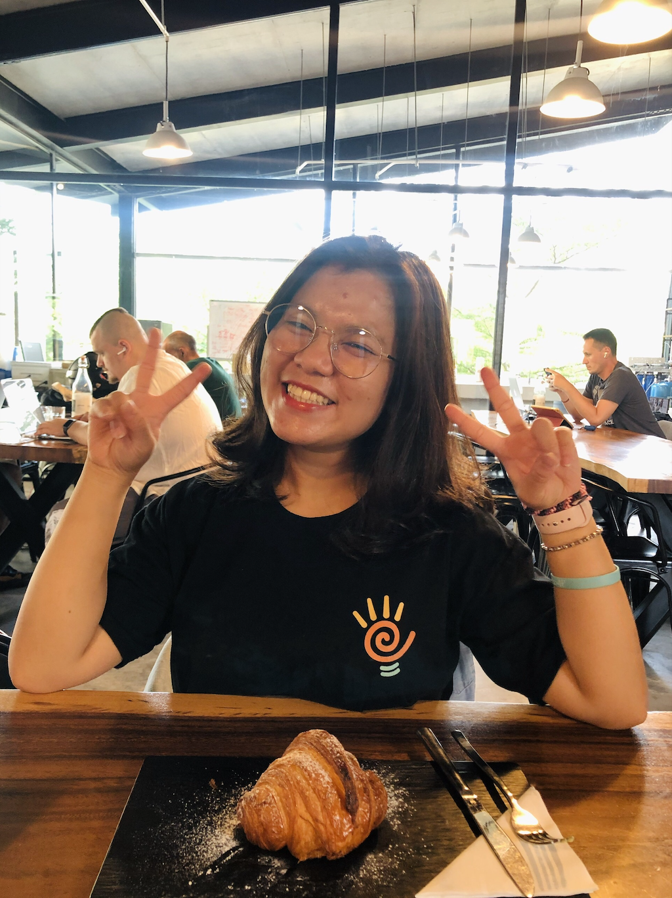

# About me

My name is Thu Dang \(pronounced like 'too dang'\) and I am an aspiring analytic consultant. 

I'm currently an Analytic Consulting Intern at Deloitte Consulting in Singapore. 

I am also a rising junior at Macalester College in Minnesota, studying Applied Mathematics & Statistics \(major\), Computer Science \(minor\), and Community & Global Health \(concentration\).

Before Deloitte, I have challenged myself in various scopes of work, ranging from strategy, consulting, and data analytics, and also in different industries. Some of my milestones are:

* 2019: Strategy and Insights Intern at Mindshare, a leading global media agency 
* 2020: Data Analytics Intern at MoMo, a leading fintech company in Vietnam
* 2021: Case Team Assistant at Boston Consulting Group \(BCG\)

As I discover my passion in the business aspects of consulting as well as the analytical mindset in data analytics, I would love to combine these in the prospects of delivering data-driven insights for business problems.

For GitHub readers, you can visit my GitBook here: [https://thudang.gitbook.io/dataland/](https://thudang.gitbook.io/dataland/)

