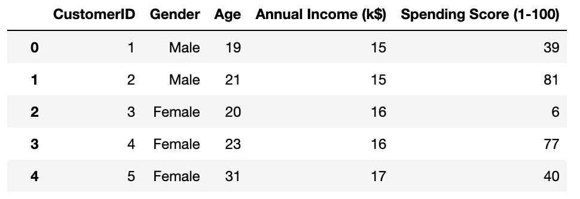
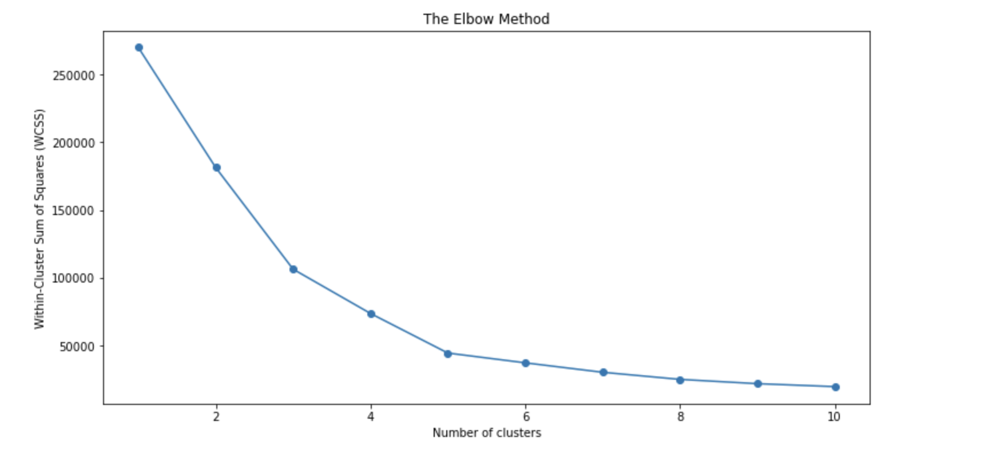
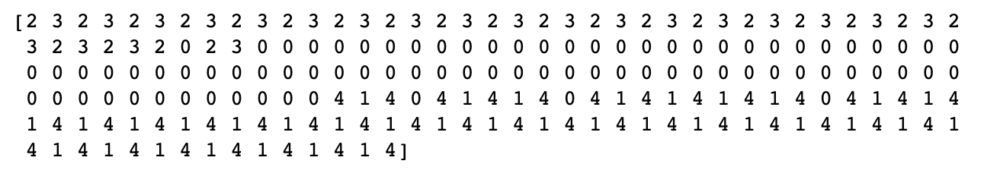
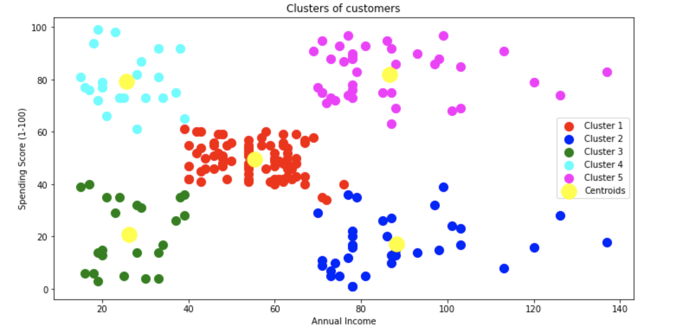

# K-Means Clustering with two variables

### 1. Import libraries

```python
import numpy as np
import matplotlib.pyplot as plt
import pandas as pd
from sklearn.cluster import KMeans
```

### 2. Import dataset

```python
dataset = pd.read_csv('Mall_Customers.csv')
```



### 3. Choose variables to use in K-Means Clustering

As CustomerID is just an arbitrary identifier for customers, it will not help much with identifying the typical characteristics of different customer segments. Therefore, it will be dropped from the dataset. 

In order to grasp the fundamental concepts of K-Means Clustering and see all the relevant steps played out, I will pick out the two variables: _Annual Income \(k$\)_ and _Spending Score \(1-100\)_. These two columns will be stored in the variable X. 

```python
X = dataset.iloc[:, [3,4]].values 
```

### 4. Find the optimal number of clusters using the elbow method

One of the most common methods to determine the optimal number of clusters is the elbow method. The elbow method runs k-means clustering on the dataset for a range of values for k \(say from 1-10\) and then for each value of k computes an average score for all clusters. By default, the sum of square distances from each point to its assigned center is computed. \[1\]

```python
from sklearn.cluster import KMeans
wcss = []
for i in range(1, 11):
    kmeans = KMeans(n_clusters = i, init = 'k-means++', random_state = 42)
    kmeans.fit(X)
    wcss.append(kmeans.inertia_)
plt.figure(figsize=(12,6))
plt.plot(range(1,11), wcss, marker='o')
plt.title('The Elbow Method')
plt.xlabel('Number of clusters')
plt.ylabel('Within-Cluster Sum of Squares (WCSS)')
plt.show()
```



As the elbow occurs at n = 5, n will be our optimal number of clusters in this case. 

### 5. Train the K-Means model on the dataset <a id="4.-Train-the-K-Means-model-on-the-dataset"></a>

After I have identified that the optimal number of clusters is 5, the next step is to categorize the customers into different clusters. 

```python
kmeans = KMeans(n_clusters = 5, init = 'k-means++', random_state = 42)
y_kmeans = kmeans.fit_predict(X)
```

y\_kmeans will contain the separate cluster numbers that our customers belong to.



### 6. Visualize the clusters

Finally, I will visualize the clusters and identify the characteristics as well as appropriate strategies for each cluster.

```python
plt.figure(figsize=(12,6))
plt.scatter(X[y_kmeans == 0, 0], X[y_kmeans == 0, 1], s = 100, c = 'red', label = 'Cluster 1')
plt.scatter(X[y_kmeans == 1, 0], X[y_kmeans == 1, 1], s = 100, c = 'blue', label = 'Cluster 2')
plt.scatter(X[y_kmeans == 2, 0], X[y_kmeans == 2, 1], s = 100, c = 'green', label = 'Cluster 3')
plt.scatter(X[y_kmeans == 3, 0], X[y_kmeans == 3, 1], s = 100, c = 'cyan', label = 'Cluster 4')
plt.scatter(X[y_kmeans == 4, 0], X[y_kmeans == 4, 1], s = 100, c = 'magenta', label = 'Cluster 5')
plt.scatter(kmeans.cluster_centers_[:, 0], kmeans.cluster_centers_[:, 1], s = 300, c = 'yellow', label = 'Centroids')
plt.title('Clusters of customers')
plt.xlabel('Annual Income')
plt.ylabel('Spending Score (1-100)')
plt.legend()
plt.show()
```



| Cluster \# | Characteristics | Strategies |
| :--- | :--- | :--- |
| Cluster 1 | Cluster-1 customers do not have a very high annual come, and they don't spend much either.  | These customers are potential for average but not too much targeting as they may not buy as much in response to the marketing activities and hence the return on investment may not be high. |
| Cluster 2 | Cluster-2 customers have a high income, but they don't spend much on shopping. |  |
| Cluster 3 | Cluster-3 customers don't have a high annual income and low spending.  | The small can ignore this group and can do the least targeting on this group as they won't potentially bring a lot of value to the mall.  |
| Cluster 4 | Cluster-4 don't have a high annual income but exhibits high spending | Although this group of customers is potential for targeting due to their high spending, it is very likely that they also have a lot of credit card debt. Therefore, it is the mall's social responsibility to decrease the temptation for this group by targeting them less. |
| Cluster 5 | Cluster-5 customers have a high annual income as well as high spending patterns  | This group of customers is definitely beneficial to the mall's growth as they purchase a lot and also they have the capacity to do it. Therefore, the mall should put effort into targeting these customers and aim to convert these customers to loyal customers. |


\[1\] [https://www.scikit-yb.org/en/latest/api/cluster/elbow.html](https://www.scikit-yb.org/en/latest/api/cluster/elbow.html)

