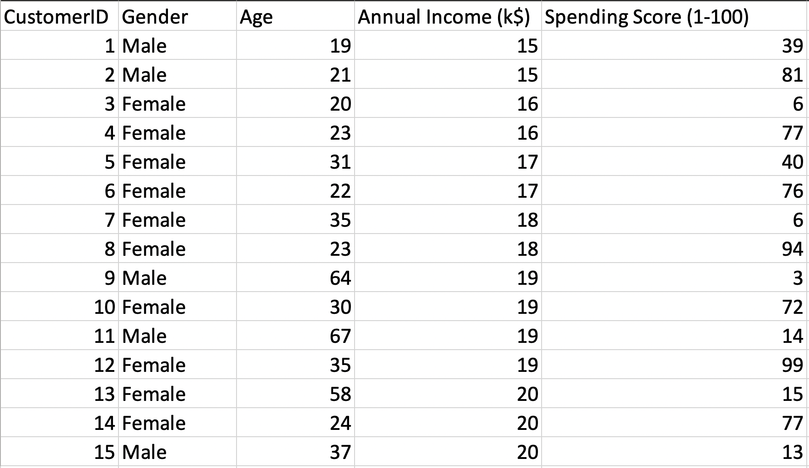

# Getting acquainted with the Data

### Data Source

The data that I'll be using is a popular public dataset on Kaggle called 'Mall Customer Segmentation Data', which can be found at this link



### A look at the data

The dataset has 5 columns x 200 rows

* Customer ID: Unique ID assigned to the customer
* Gender: Gender of the customer
* Age: Age of the customer
* Annual Income \(k$\): Annual Income of the customer
* Spending Score \(1-100\): Score assigned by the mall based on customer behavior and spending nature

