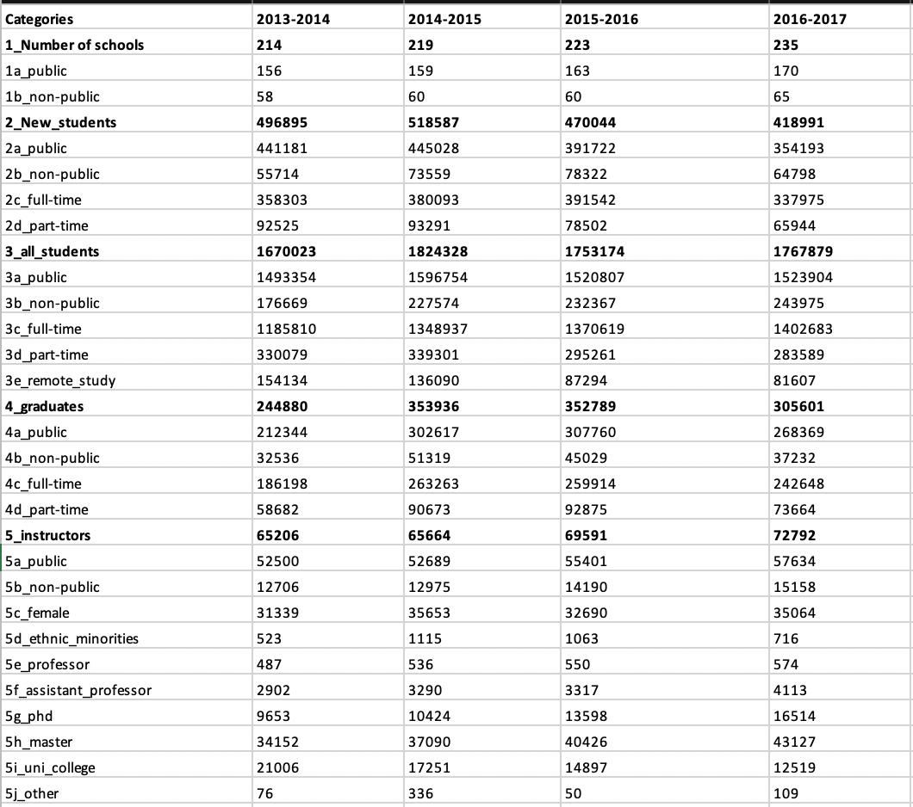
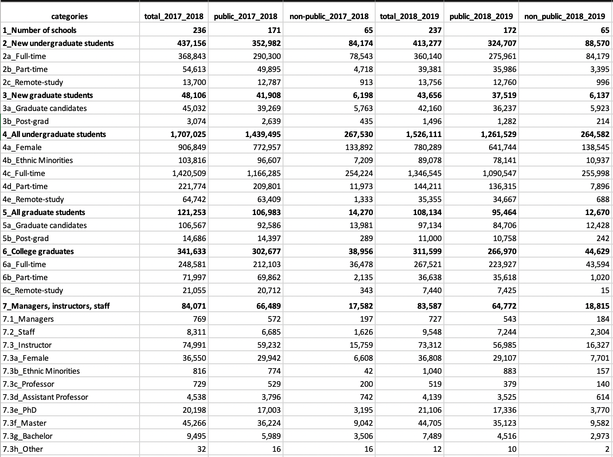

# Getting acquainted with the Data

Finding public data for certain industries in Vietnam is a struggle, mainly due to the inadequate investment in infrastructure used to collect data. Therefore, data collected by public sources are messy and cleaning is a must.

### Data source

I gathered the Excel-formated data from the website of the Ministry of Education and Training in Vietnam

[https://moet.gov.vn/thong-ke/Pages/thong-ko-giao-duc-dai-hoc.aspx](https://moet.gov.vn/thong-ke/Pages/thong-ko-giao-duc-dai-hoc.aspx)

I was able to collect 5 years' worth of university-related data, from 2014 - 2019. However, the format of the 2014 - 2017 data is not consistent with that of 2017 - 2019. The biggest difference is that, from 2014 to 2017, the data do not segment the statistics for undergraduate and graduate students, while the 2017 - 2019 data do. Therefore, some strategies and assumptions are needed if we wish to look at the data in the whole 5 years.

### A look at the data

_2014 - 2017 data \(fields have been changed from Vietnamese to English\)_

_2017 - 2019 data \(fields have been changed from Vietnamese to English\)_

While the 2017 - 2019 dataset breaks the student pool down to undergraduate- and graduate-level students, the 2014 - 2017 data does not. Therefore, joining these two datasets might require some assumptions. I will specify when I use the datasets individually or combine them. Also, as the data is limited, I will try to generate as many findings as possible. 

