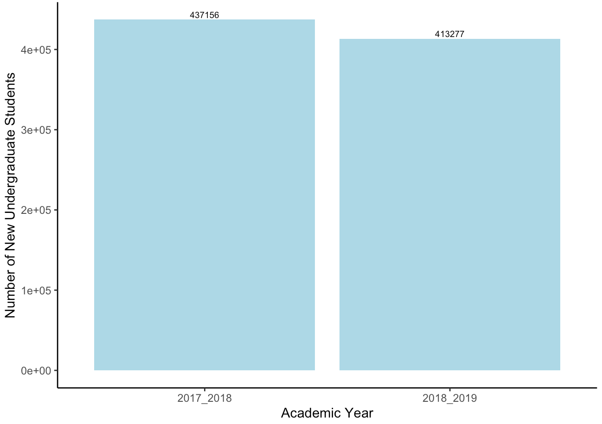
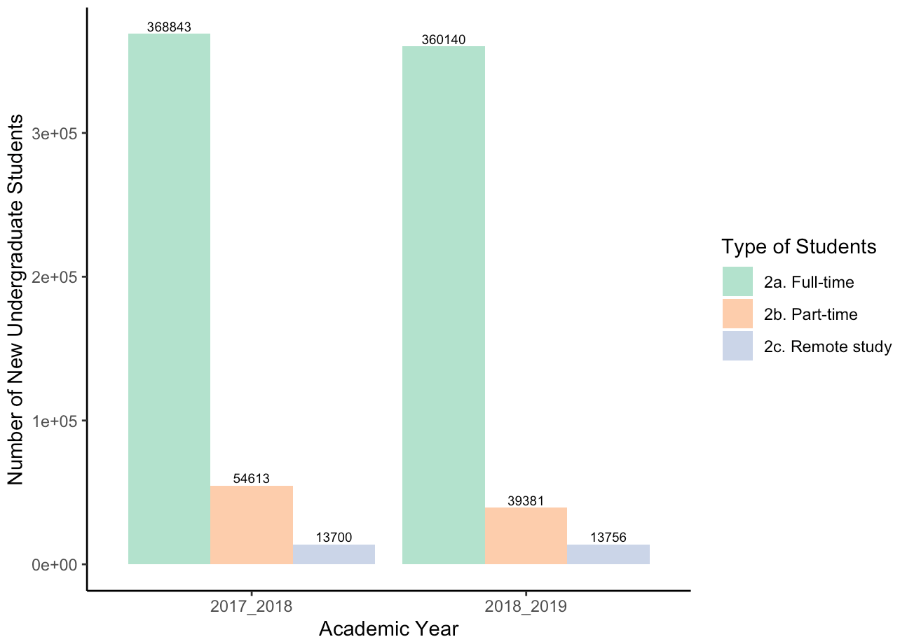
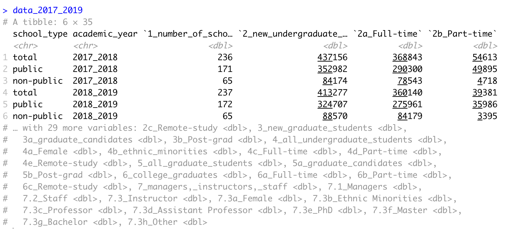

# New undergraduate students annually

I first created a chart to visualize the number of new undergraduate students every year from 2017 to 2019 in Vietnam. 

The decrease in the number of new undergraduate students from 2017-2018 to 2018-2019 is an interesting insight. In 2018, the Vietnamese Department of Education devised a completely new version for the university entrance examination; as a result, there were barely any review materials for the students, which may have led to more students failing the exam compared to the previous years. 



Then I broke them down into different categories of students: Full-time, Part-time, and Remote study



My code is as follows

```r
# Install libraries
install.packages("RColorBrewer")

# Import libraries
library(readxl) # to read excel files
library(dplyr) # to carry out data wrangling functions
library(magrittr) # to write pipes (denoted as %>%)
library(ggplot2) # to draw graphs
library(stringr) # to wrangle strings
library(tidyr) # to tidy data
library(RColorBrewer) # for color palette

# Import dataset
data_2017_2019 <- read_excel("data_2017_2019.xlsx", sheet = "Final clean data")
```

My data is in this form, which contains 6 rows and 35 columns: 



From there, I carried out 5 main steps:

* Step 1: As there are 3 categories of schools in this dataset \(total, public, non-public\), I want to focus only on school\_type == total. I use `filter` here

```r
new_undergraduate_student <- data_2017_2019 %>% 
  filter(school_type == 'total') # filter out school type = 'total'
```

* As there are 35 columns in this dataset, I just want to keep the relevant columns for my visualization. Therefore, I use `select` to pick out the columns I need. 

```r
new_undergraduate_student <- data_2017_2019 %>% 
  filter(school_type == 'total') %>% # filter out school type = 'total'
  select(academic_year, `2_new_undergraduate_students`, `2a_Full-time`, `2b_Part-time`, `2c_Remote-study`) 
  # select columns relevant to our topic, which is undergraduatr student here
```

* After this step, in order to draw a bar chart, I have to transform the current table from wide to long form. I use `pivot_longer` to do this. 

```r
new_undergraduate_student <- data_2017_2019 %>% 
  filter(school_type == 'total') %>% # filter out school type = 'total'
  select(academic_year, `2_new_undergraduate_students`, `2a_Full-time`, `2b_Part-time`, `2c_Remote-study`) %>% 
  # select columns relevant to our topic, which is undergraduatr student here
  pivot_longer(!academic_year, names_to = "categories", values_to = "values") 
  # change table structure from wide to long to visualize
```

* In order to make the output category names cleaner \(e.g. from `2_new_undergraduate_students` to `2. New undergraduate students`\), I create a new column and use `case_when` to update the new name

```r
new_undergraduate_student$edited_categories <- case_when(
  new_undergraduate_student$categories == "2_new_undergraduate_students" ~ "2. New undergraduate students",
  new_undergraduate_student$categories == "2a_Full-time" ~ "2a. Full-time",
  new_undergraduate_student$categories == "2b_Part-time" ~ "2b. Part-time",
  new_undergraduate_student$categories == "2c_Remote-study" ~ "2c. Remote study",
  TRUE ~ as.character(new_undergraduate_student$categories)
)
```

* Then, I use `ggplot` to visualize my data

For the first bar chart with the total number of new undergraduate students, I pick out the relevant columns to visualize it. I also carry out similar steps with my second bar chart. 

```r
# All new undergraduate students from 2017 to 2019 in Vietnam

all_new_undergrad <- subset(new_undergraduate_student, edited_categories == "2. New undergraduate students")

all_new_undergrad %>% 
  ggplot(aes(x=academic_year, y = values)) + 
  geom_col(fill = 'Light Blue') +
  labs(x='Academic Year', y='Number of New Undergraduate Students') + 
  geom_text(aes(label = values), vjust=-0.3, size = 2.5) + 
  theme_classic()
```

```r
# Breakdown of new undergraduate students from 2017 to 2019 in Vietnam

undergrad_breakdown <- subset(new_undergraduate_student, edited_categories != "2. New undergraduate students")

undergrad_breakdown %>% 
  ggplot(aes(x=academic_year, y = values, fill=edited_categories)) + 
  geom_col(position = "dodge") +
  scale_fill_brewer(palette="Pastel2") +
  labs(x='Academic Year', y='Number of New Undergraduate Students', fill = 'Type of Students') + 
  geom_text(aes(label = values), position=position_dodge(0.9), vjust=-0.3, size = 2.5) + 
  theme_classic()
```


