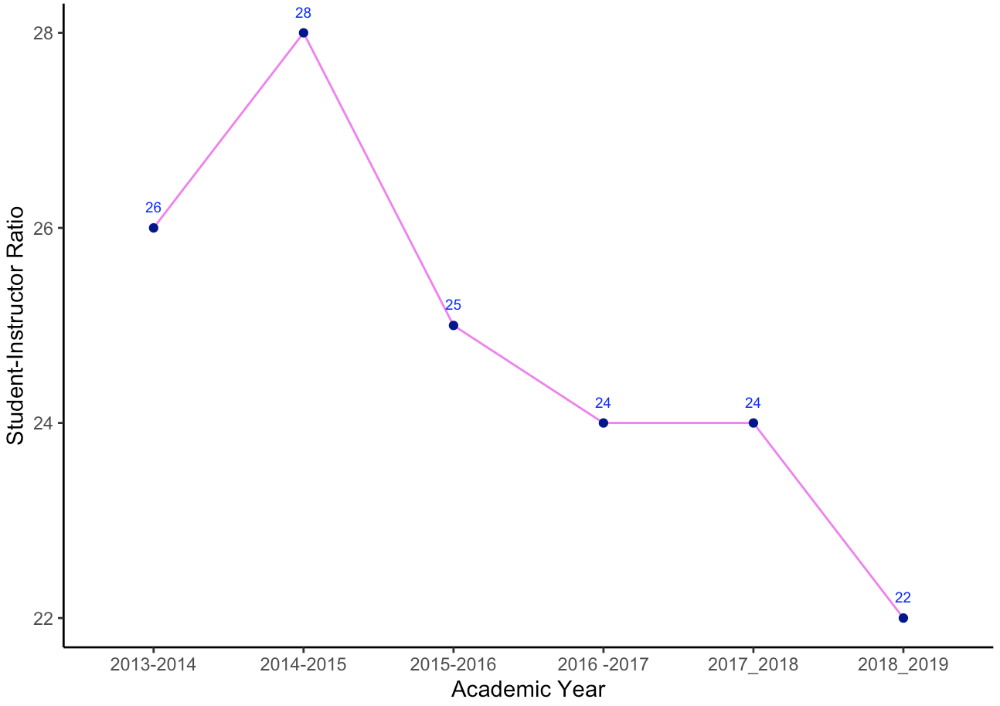
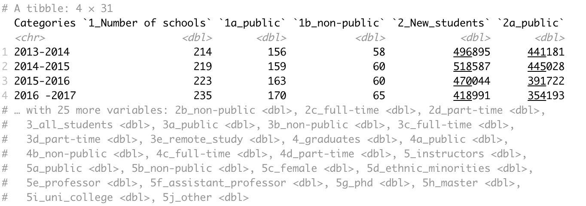

# Student-Instructor Ratio in Vietnam

One of the challenges I gave my students during my data analysis course is to visualize the student-instructor ratio for all undergraduate and graduate students from 2013 to 2019. The most challenging part is that, because the 2013-2017 dataset and the 2017-2019 dataset have different structures, the students have to figure out how to calculate the student-instructor ratio differently and merge the two tables together. 

Here is my final result: 



The overall trend for the student-instructor ratio is decreasing, from 26 students per 1 instructor in 2013-2014 to 22 students per 1 instructor in 2018-2019. This is a good sign because Vietnamese undergraduate and graduate students will potentially have more time to interact with and hence receive more help from their instructors.

Here is the dataset that I used: 

* For 2013-2017



* For 2017 - 2019


Here is the R script I wrote as an answer to this challenge, with the least amount of code possible:

```r
# Install packages
install.packages("RColorBrewer")

# Import libraries
library(readxl) # to read excel files
library(dplyr) # to carry out data wrangling functions
library(magrittr) # to write pipes (denoted as %>%)
library(ggplot2) # to draw graphs
library(stringr) # to wrangle strings
library(tidyr)
library(RColorBrewer) # for color palette

# Import dataset
data_2013_2017 <- read_excel("data_2013_2017.xls", sheet = "transpose_data")
data_2017_2019 <- read_excel("data_2017_2019.xlsx", sheet = "Final clean data")

# Select dataset
ratio_2013_2017 <- data_2013_2017 %>%
  mutate(ratio = round(`3_all_students`/`5_instructors`), 0) %>% 
  rename(academic_year = Categories) %>% 
  select(academic_year, ratio)

ratio_2017_2019 <- data_2017_2019 %>% 
  mutate(ratio = round((`4_all_undergraduate_students`+`5_all_graduate_students`)/`7.3_Instructor`), 0) %>% 
  filter(school_type == 'total') %>%
  select(academic_year, ratio)

final_ratio_data <- rbind(ratio_2013_2017, ratio_2017_2019)

final_ratio_data %>% 
  ggplot(aes(x=academic_year, y=ratio, group = 1)) +
  geom_line(color="violet") + 
  geom_point(color = "dark blue") + 
  labs(x='Academic Year', y='Student-Instructor Ratio') + 
  geom_text(aes(label = ratio), vjust=-1.5, size = 2.5, color="blue") + 
  theme_classic()
```


