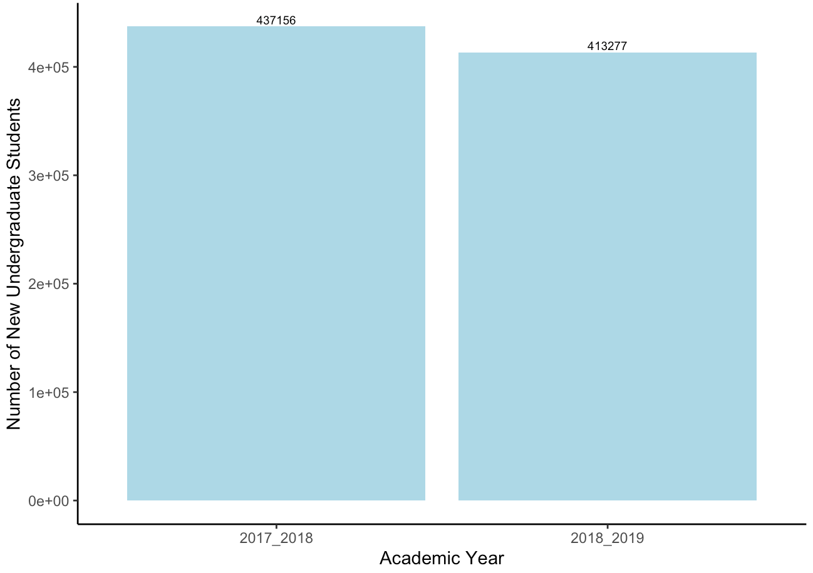
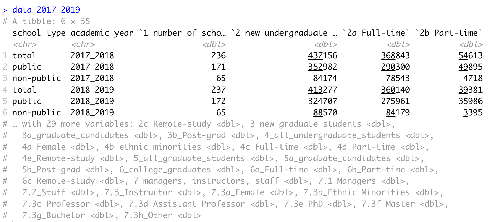

# Undergraduate Students

I first created a chart to visualize the number of new undergraduate students every year from 2017 to 2019 in Vietnam. 



Then I broke them down into different categories of students: Full-time, Part-time, and Remote study


My code is as follows

```r
# Import dataset
data_2017_2019 <- read_excel("data_2017_2019.xlsx", sheet = "Final clean data")
```

My data is in this form, which contains 6 rows and 35 columns: 



From there, I carried out 5 main steps:

* Step 1: As there are 3 categories of schools in this dataset \(total, public, non-public\), I want to focus only on school\_type == total. I use `filter` here

```r
new_undergraduate_student <- data_2017_2019 %>% 
  filter(school_type == 'total') # filter out school type = 'total'
```

* As there are 35 columns in this dataset, I just want to keep the relevant columns for my visualization. Therefore, I use `select` to pick out the columns I need. 

```r
new_undergraduate_student <- data_2017_2019 %>% 
  filter(school_type == 'total') %>% # filter out school type = 'total'
  select(academic_year, `2_new_undergraduate_students`, `2a_Full-time`, `2b_Part-time`, `2c_Remote-study`) 
  # select columns relevant to our topic, which is undergraduatr student here
```


