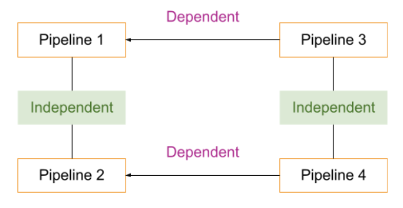

# Before vs. After parallel execution

### Before parallel execution

I triggered the Data Fusion pipelines in sequences. For example, if there are 4 pipelines, then I would run pipeline 1 and check its status first. If the status is COMPLETED, meaning the pipeline finishes its run, then the next pipeline will be triggered and checked for status. The sequence of my code was as follows:&#x20;

`Trigger Pipeline 1 --> Check status Pipeline 1 --> Pipeline 1 succeeds --> Trigger Pipeline 2 --> Check status Pipeline 2 --> Pipeline 2 succeeds --> Trigger Pipeline 3 --> Check status Pipeline 3 --> Pipeline 3 succeeds --> Trigger Pipeline 4 --> Check status Pipeline 4 --> Pipeline 4 succeeds --> End`

However, this is extremely time-consuming since these 4 pipelines are not entirely dependent on one another. If pipeline 3 is contingent on the success of pipeline 1, pipeline 4 is contingent on the success of pipeline 2, and either pipelines 1 and 2 or 3 and 4 are independent of one another, pipelines 1 and 2 can run at the same time, and then pipelines 3 and 4 can be run when pipelines 1 and 2 finish running respectively. This is _parallel execution_.&#x20;

### After parallel execution

I sought out to write a new parallel structure for my code program. My code sequence is as follows:&#x20;

`Trigger Pipeline 1 and 2 -->`\
`Check status Pipeline 1 --> Pipeline 1 succeeds --> Trigger Pipeline 3`\
`Check status Pipeline 2 --> Pipeline 2 succeeds --> Trigger Pipeline 4`

In my real project, I used this parallel execution method to coordinate 8 pipelines, and I successfully reduced the runtime by 70%, from 2 hours to only 30 minutes.&#x20;
