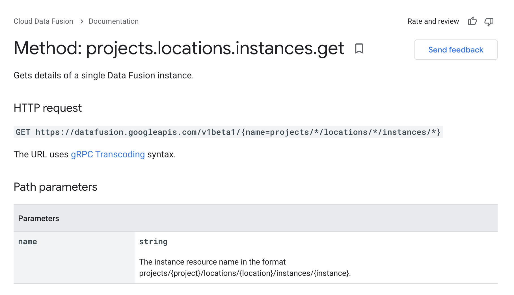
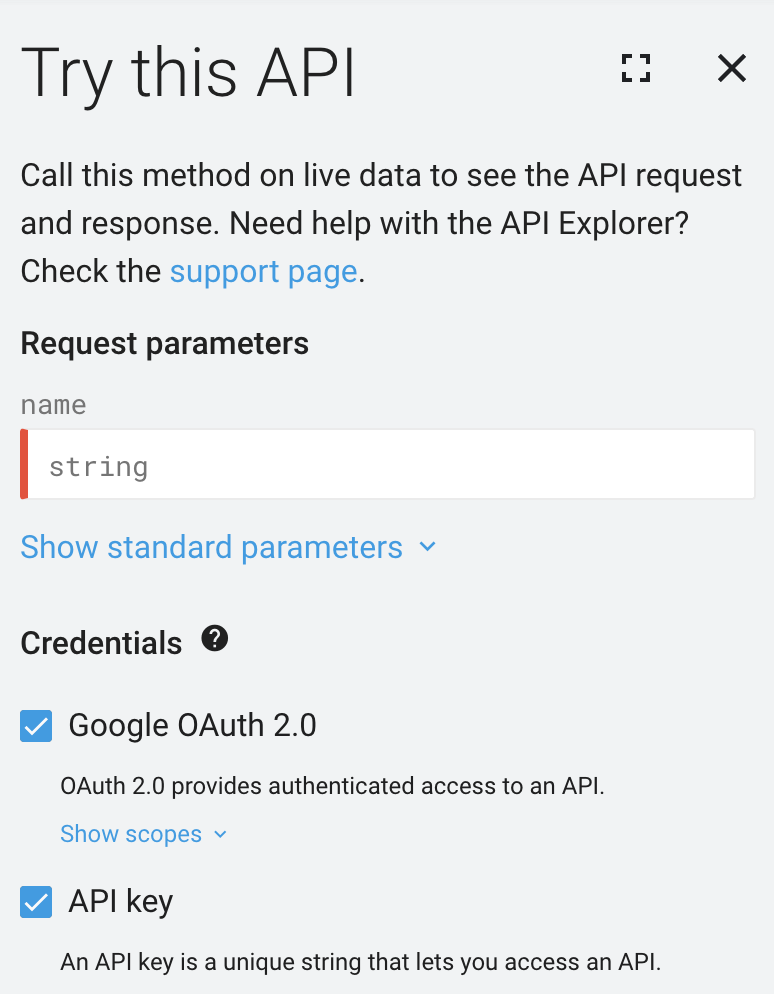

# How to call Data Fusion pipelines remotely from Workflows

One of the tricky parts of this process is to find an appropriate URL to call the Data Fusion pipeline from Workflows. The URL should look as follows:&#x20;

`https://fusionpipeline-PROJECT-ID-dot-usw1.datafusion.googleusercontent.com/api/v3/namespaces/default/apps/NAME-OF-DATAFUSION-PIPELINE/workflows/DataPipelineWorkflow/start`

Don't worry, I'll help you decode this URL right now. But first, you need to understand how Data Fusion is created in order for my explanation to make sense.&#x20;

Data Fusion is a GCP service that is built with an open-source core ([CDAP](https://cdap.io/)) for pipeline portability. Therefore, information on the API calls used for Data Fusion can be found in CDAP documentation.&#x20;

Okay, let's decode how do we find this URL.&#x20;

1. Get the first part of the URL a.k.a. API endpoint [`https://fusionpipeline-PROJECT-ID-dot-usw1.datafusion.googleusercontent.com/api`](https://fusionpipeline-project-id-dot-usw1.datafusion.googleusercontent.com/api)using this Data Fusion API method projects.locations.instances.get&#x20;
2. Get the second part of the URL`v3/namespaces/default/apps/NAME-OF-DATAFUSION-PIPELINE/workflows/DataPipelineWorkflow/start`from the CDAP documentation.&#x20;

Then I'll show you how we can call the URL from Workflows.

Let's start!

#### Step 1: The first part

Access the Data Fusion API method projects.locations.instances.get here: [https://cloud.google.com/data-fusion/docs/reference/rest/v1beta1/projects.locations.instances/get](https://cloud.google.com/data-fusion/docs/reference/rest/v1beta1/projects.locations.instances/get)



You can try out the API on the same page to get the API endpoint:&#x20;



After filling out the instance resource name in the format `projects/{project}/locations/{location}/instances/{instance}`, you can execute and get this output, from which you can extract the first part from the `apiEndpoint`.&#x20;

```yaml
{
  "name": "projects/PROJECT-ID/locations/us-west1/instances/fusionpipeline",
  "type": "BASIC",
  "networkConfig": {},
  "createTime": "2021-06-01T08:09:45.520599709Z",
  "updateTime": "2021-06-29T16:22:57.331204109Z",
  "state": "RUNNING",
  "serviceEndpoint": "https://fusionpipeline-PROJECT-ID-dot-usw1.datafusion.googleusercontent.com",
  "version": "6.4.1",
  "serviceAccount": "cloud-datafusion-management-SERVICE-ACCOUNT.iam.gserviceaccount.com",
  "displayName": "FusionPipeline",
  "apiEndpoint": "https://fusionpipeline-PROJECT-ID-dot-usw1.datafusion.googleusercontent.com/api",
  "gcsBucket": "gs://df-XXX",
  "p4ServiceAccount": "SERVICE-ACCOUNT@gcp-sa-datafusion.iam.gserviceaccount.com",
  "tenantProjectId": "gfXXX-tp",
  "dataprocServiceAccount": "SERVICE-ACCOUNT@developer.gserviceaccount.com"
}
```

Retrieve the API endpoint:&#x20;

`apiEndpoint": "https://fusionpipeline-PROJECT-ID-dot-usw1.datafusion.googleusercontent.com/api`

#### Step 2: The second part

Access the relevant CDAP documentation here: [https://cdap.atlassian.net/wiki/spaces/DOCS/pages/477560983/Lifecycle+Microservices#Start-a-Program](https://cdap.atlassian.net/wiki/spaces/DOCS/pages/477560983/Lifecycle+Microservices#Start-a-Program)

The second part is fundamentally an HTTP POST request to enable Workflows to locate and run the relevant Workflows. The syntax of this request is:&#x20;

`POST /v3/namespaces/<namespace-id>/apps/<app-id>/<program-type>/<program-id>/start`

To use this in our context, it would be like this:&#x20;

`v3/namespaces/default/apps/NAME-OF-DATAFUSION-PIPELINE/workflows/DataPipelineWorkflow/start`

where&#x20;

`namespace-id = default`

`app-id = NAME-OF-DATAFUSION-PIPELINE`

`program-type = workflows`

`program-id = DataPipelineWorkflow`

Okay, you have finished creating the Data Fusion URL used for remote triggering! So let's move on to...

#### Step 3: Run the Data Fusion pipeline URL from Workflows

Workflows uses the YAML script to run services. The YAML script used to create an HTTP POST request for the Data Fusion URL is as follows:

```
- triggerDataFusion_Pipeline: 
    call: http.post
    args:
        url: https://fusionpipeline-PROJECT-ID-dot-usw1.datafusion.googleusercontent.com/api/v3/namespaces/default/apps/NAME-OF-DATAFUSION-PIPELINE/workflows/DataPipelineWorkflow/start
        headers: 
            Authorization: ${token}     
```

This code will create an HTTP POST request to the server in order to trigger Data Fusion pipelines to run, and then authenticate it with the authentication token. Within 2-3 seconds, the Data Fusion pipeline will run.&#x20;

So the next question is:&#x20;

_How do we automatically generate a real-time token to authenticate the process?_

**References**

\[1] \
****[https://cloud.google.com/data-fusion/docs/reference/rest/v1beta1/projects.locations.instances/get](https://cloud.google.com/data-fusion/docs/reference/rest/v1beta1/projects.locations.instances/get)****

\[2]\
[https://cdap.atlassian.net/wiki/spaces/DOCS/pages/477560983/Lifecycle+Microservices#Start-a-Program](https://cdap.atlassian.net/wiki/spaces/DOCS/pages/477560983/Lifecycle+Microservices#Start-a-Program)

****\
****


